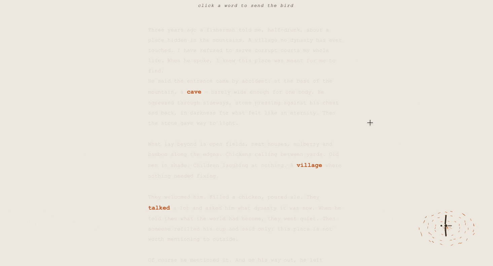
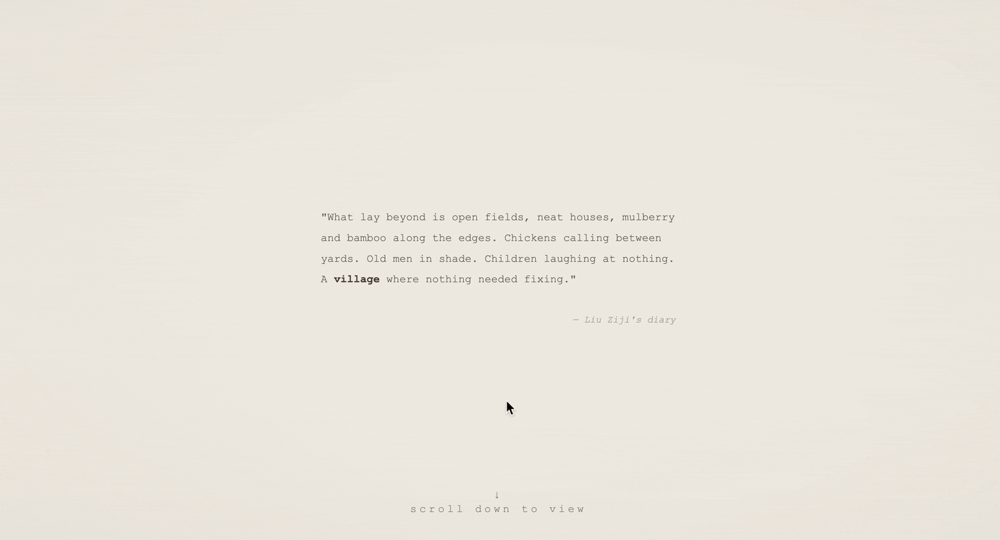

# Peach Blossom Spring 🌸

> *An interactive adaptation of Peach Blossom Spring through the eyes of a bird*

**Created by:** Yuhan Liu

## Overview

A man heard of a hidden paradise and spent his life trying to find it. In this retelling of Tao Yuanming's *Peach Blossom Spring*, you become the bird 🐦 that flies through that same place effortlessly because it never thought it was lost.

## 👀 Abstract

*Peach Blossom Spring* (桃花源记), written by Tao Yuanming in 421 AD, tells of a fisherman who stumbles into a hidden paradise untouched by the outside world and can never find his way back. The last person to search for it, a man named Liu Ziji, died without reaching it. This project adapts the fable by first entering Liu Ziji's diary through interaction, then **shifting into the perspective of a bird** that lives among it all. Each keyword on the page opens a scene — a narrow cave, a vibrant village, conversations between the fisherman and villagers, trail marks left on the path back. The bird does not search. **It simply flies, seeing what happens, but feeling none of their longing.**

## ✨ Preview

*Navigate the main bird-view webpage and click the keyword village.*

*Travelling and interacting with the village page.*

**Play with [Peach Blossom Spring](https://tinaliu0123.github.io/Commlab/PeachBlossomSpring/) Here!**
