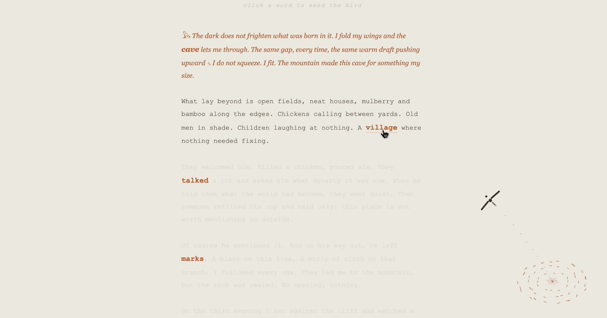
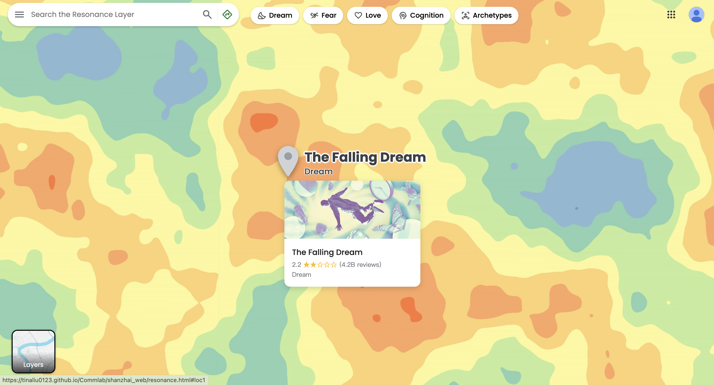
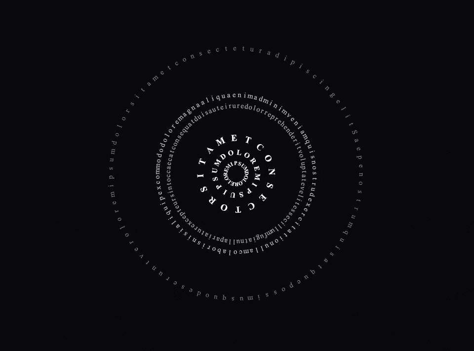
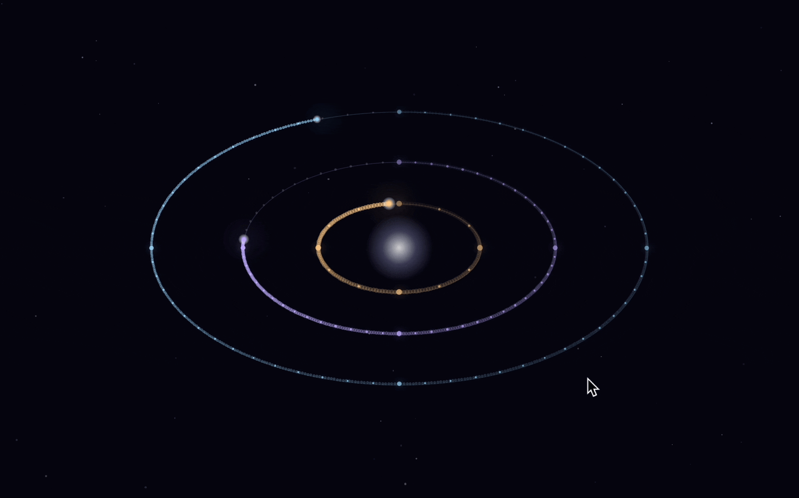

# Commlab
Web projects exploring storytelling, interaction, and visual form — made for **INTM-SHU 120 Communications Lab**. 🪄 Come play: [tinaliu0123.github.io/Commlab](https://tinaliu0123.github.io/Commlab)

## ✦ Featured Projects

### 🌸 Peach Blossom Spring
- **Medium:** Web (HTML, CSS, JavaScript)
- **📖 Documentation:** See [`PeachBlossomSpring/README.md`](PeachBlossomSpring/README.md) for project overview, abstract and interaction preview
- 🔗 [Live webpage](https://tinaliu0123.github.io/Commlab/PeachBlossomSpring/)
- 📂 [Code](https://github.com/Tinaliu0123/Commlab/tree/main/PeachBlossomSpring)

### 🗺️ Shanzhai Web: The Resonance Layer
- **Medium:** Web (HTML, CSS)
- **📖 Documentation:** See [`shanzhai_web/README.md`](shanzhai_web/README.md) for project overview, design concept and interaction walkthrough  
- 🔗 [Live webpage](https://tinaliu0123.github.io/Commlab/shanzhai_web/)
- 📂 [Code](https://github.com/Tinaliu0123/Commlab/tree/main/shanzhai_web)

### 🌲 Tutorial on the Web: How to Become a Tree?
- **Medium:** Web (HTML)
- 🔗 [Live webpage](https://tinaliu0123.github.io/Commlab/tutorial/)
- 📂 [Code](https://github.com/Tinaliu0123/Commlab/tree/main/tutorial)

---

## ✧ Course Exercises

### 🧘 Life Scroll: Observe My Mind
- **Medium:** Web (HTML)
- 🔗 [Live webpage](https://tinaliu0123.github.io/Commlab/yuhan-life-scroll/)
- 📂 [Code](https://github.com/Tinaliu0123/Commlab/tree/main/yuhan-life-scroll)

<!--  -->

### 🧸 Journey Through Spreadsheets

- **Medium:** Google Sheets
- 🔗 [Live project](https://docs.google.com/spreadsheets/d/13V0v_KpksMYIk4VfGUJB7WRcY7odHRPk5ghLlrq07bs/edit?usp=sharing) 

### 🌀 Lorem Animatum: Field
- **Medium:** Web (HTML, CSS)
- 🔗 [Live webpage](https://tinaliu0123.github.io/Commlab/field/)
- 📂 [Code](https://github.com/Tinaliu0123/Commlab/tree/main/field)

### 🌌 DOM Entropy: Nebula
- **Medium:** Web (HTML, CSS, JavaScript)
- 🔗 [Live webpage](https://tinaliu0123.github.io/Commlab/nebula/)
- 📂 [Code](https://github.com/Tinaliu0123/Commlab/tree/main/nebula)

### 🪐 The Clock in Space
- **Medium:** Web (HTML, CSS, JavaScript)
- 🔗 [Live webpage](https://tinaliu0123.github.io/Commlab/clock/)
- 📂 [Code](https://github.com/Tinaliu0123/Commlab/tree/main/clock)

