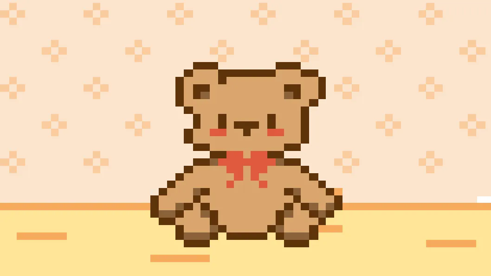
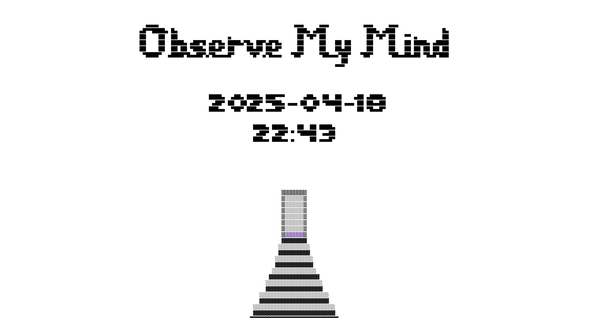
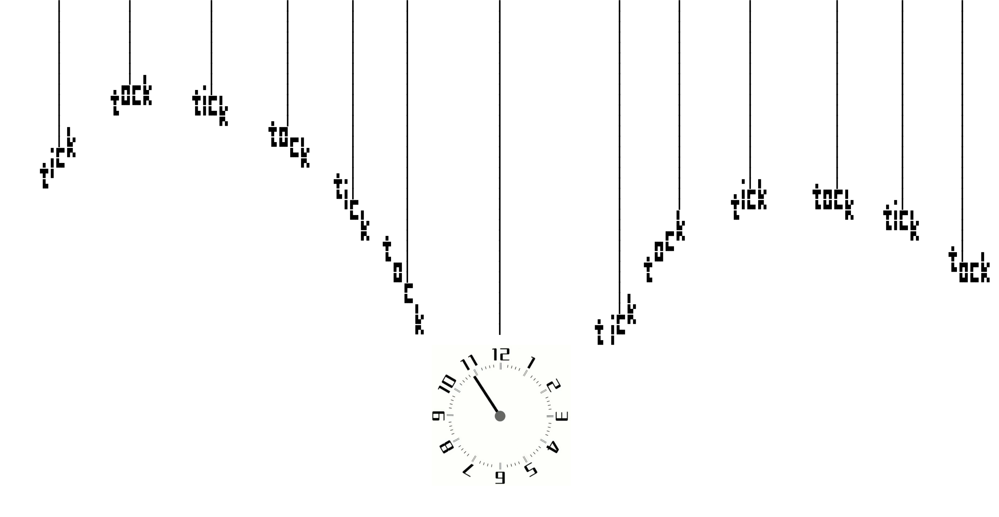
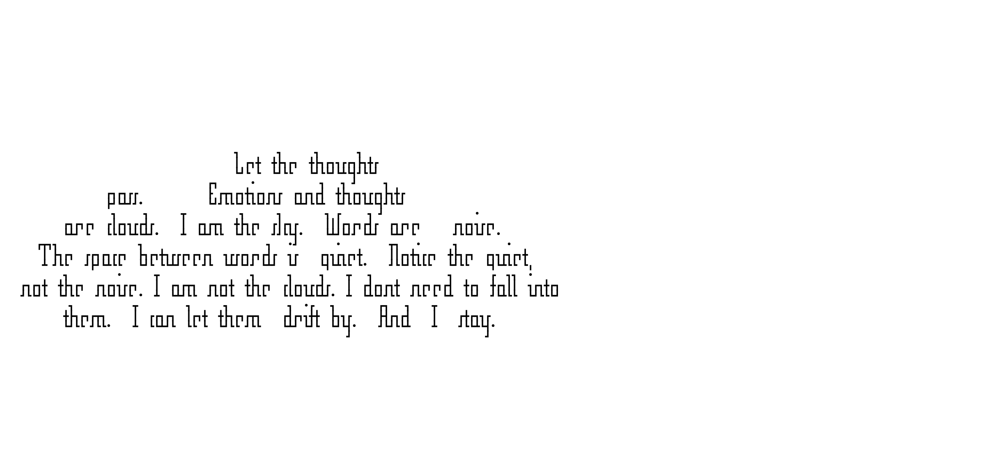
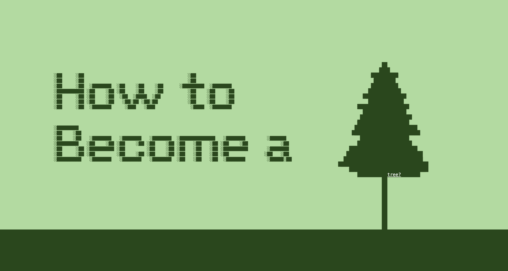
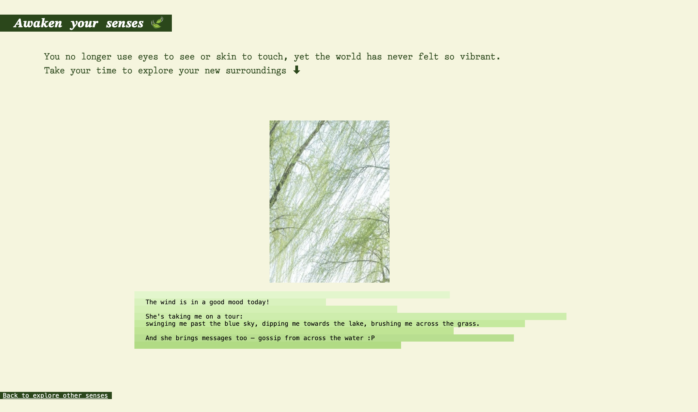

# Commlab
A collection of web projects developed for the **INTM-SHU 120 Communications Lab** course. The live link to my projects is: [https://tinaliu0123.github.io/Commlab](https://tinaliu0123.github.io/Commlab).

## Projects

### 🧸 Journey Through Spreadsheets

- **Medium:** Google Sheets
- 🔗 [Live project](https://docs.google.com/spreadsheets/d/13V0v_KpksMYIk4VfGUJB7WRcY7odHRPk5ghLlrq07bs/edit?usp=sharing) 

<!--  -->

---

### 🧘 Life Scroll: Observe My Mind
- **Medium:** Web (HTML)
- 🔗 [Live webpage](https://tinaliu0123.github.io/Commlab/yuhan-life-scroll/)
- 📂 [Code](yuhan-life-scroll)

<!--  -->

---

### 🌲 Tutorial on the Web: How to Become a Tree?
- **Medium:** Web (HTML)
- 🔗 [Live webpage](https://tinaliu0123.github.io/Commlab/tutorial/)
- 📂 [Code](tutorial)

