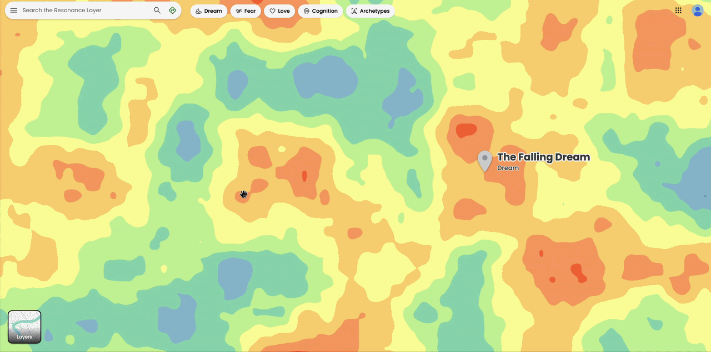

# Shanzhai Web: The Resonance Layer 🗺️
**Created by:** Yuhan Liu

> *Mapping the shared landscapes of human memory, fear, and dreams.*

## Overview
**The Resonance Layer** reimagines Google Maps as a map of the internal world rather than the physical one. It allows users to navigate the collective human unconscious and discover the universal experiences that connect us all 🌐.

## 💭 Concept

Maps usually describe the external world in terms of territories, borders, and distances. But what if mapping could also reveal the invisible landscapes of the human interior? *The Resonance Layer* appropriates the familiar interface of Google Maps to explore Carl Jung’s concept of the **collective unconscious**: a foundation of shared psychological experiences that resonate across cultures and generations. 

Instead of geographic landmarks, the map visualizes universal experiences such as **fear of the dark**, **falling dreams**, **lullabies**, **heroic narratives**, and **déjà vu**. Each location contains reviews spanning from historical figures to modern individuals, illustrating how specific emotional states echo across time. Ultimately, this reinterpretation invites viewers to reconsider the hidden connections that bind us together, revealing that **in our deepest feelings, we all navigate the same internal world 🧡.**

## ✨ Preview

*Transition from the Google Maps interface into the hidden Resonance Layer.*

*Hover over and click a location to reveal information and reviews of these shared experiences.*

**Play with [the Resonance Layer](https://tinaliu0123.github.io/Commlab/shanzhai_web/) Here!**